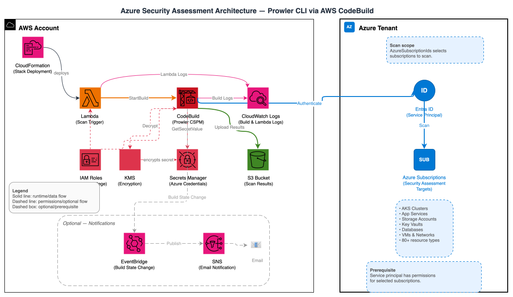

# Azure Security Assessment Templates

This directory contains CloudFormation templates for deploying Azure security assessments using Prowler. These templates provide a comprehensive, automated approach to security scanning of Azure environments from AWS infrastructure.

## Table of Contents

- [Directory Structure](#directory-structure)
- [Template Overview](#template-overview)
- [Architecture](#architecture)
- [Quick Start](#quick-start)
  - [Single Subscription Deployment](#single-subscription-deployment)
  - [Multi-Subscription Deployment](#multi-subscription-deployment)
- [Overview](#overview)
- [Prerequisites](#prerequisites)
  - [Azure Prerequisites](#azure-prerequisites)
  - [AWS Prerequisites](#aws-prerequisites)
- [Deployment Instructions](#deployment-instructions)
  - [Step 1: Prepare Azure Service Principal](#step-1-prepare-azure-service-principal)
  - [Step 2: Deploy the CloudFormation Template](#step-2-deploy-the-cloudformation-template)
- [Common Configurations](#common-configurations)
  - [Comprehensive Security Audit](#comprehensive-security-audit)
  - [High-Performance Multi-Subscription](#high-performance-multi-subscription)
  - [Step 3: Verify Deployment](#step-3-verify-deployment)
- [Configuration Parameters](#configuration-parameters)
  - [Scan Type](#scan-type)
- [Running Scans](#running-scans)
  - [Automatic Scan on Deployment](#automatic-scan-on-deployment)
  - [Manual Scan Triggers](#manual-scan-triggers)
- [Understanding Scan Results](#understanding-scan-results)
  - [Output Formats](#output-formats)
  - [Viewing Scan Progress](#viewing-scan-progress)
  - [Accessing Results](#accessing-results)
  - [Analyzing Results](#analyzing-results)
- [Customization Options](#customization-options)
  - [Prowler Options](#prowler-options)
  - [Concurrent Scanning](#concurrent-scanning)
- [Security Considerations](#security-considerations)
  - [Built-in Security Features](#built-in-security-features)
  - [Credential Management](#credential-management)
- [Troubleshooting](#troubleshooting)
  - [Common Issues](#common-issues)
  - [Built-in Error Handling](#built-in-error-handling)
  - [Debug Mode](#debug-mode)
  - [Monitoring Build Progress](#monitoring-build-progress)
  - [Diagnostic Commands](#diagnostic-commands)
- [Cleanup / Uninstall](#cleanup--uninstall)
- [Maintenance and Updates](#maintenance-and-updates)
  - [Regular Tasks](#regular-tasks)
  - [Next Steps After Deployment](#next-steps-after-deployment)
- [Additional Resources](#additional-resources)
- [Support](#support)

## Directory Structure

```
azure/
├── README.md                           # This comprehensive documentation
├── codebuild-prowler-azure.yaml        # Main Azure scanning solution
├── azure-assessment-architecture.drawio # Editable architecture source
└── checks/                             # Prowler check definitions
    ├── azure_intermediate_checks.txt   # Critical and high severity checks
    ├── azure_full_checks.txt           # Complete check list
    └── list-azure-checks.sh            # Script to generate check lists
```

## Template Overview

| Template          | Purpose                                    | Best For               |
| ----------------- | ------------------------------------------ | ---------------------- |
| **Azure Scanner** | Security assessment of Azure subscriptions | All Azure environments |

## Architecture



The Azure-only Prowler solution uses a cross-cloud architecture where AWS CodeBuild orchestrates security scans of Azure subscriptions. The diagram above illustrates the complete data flow, authentication mechanisms, and security controls involved in scanning Azure environments from AWS infrastructure.

## Quick Start

### Single Subscription Deployment

```bash
# Run from the azure/ directory of this repository

aws cloudformation deploy \
  --template-file codebuild-prowler-azure.yaml \
  --stack-name azure-prowler-scanner \
  --capabilities CAPABILITY_NAMED_IAM \
  --parameter-overrides \
    AzureClientId=12345678-1234-1234-1234-123456789012 \
    AzureClientSecret=your-client-secret \
    AzureTenantId=87654321-4321-4321-4321-210987654321 \
    AzureSubscriptionIds=your-subscription-id \
    EmailAddress=your-email@company.com
```

### Multi-Subscription Deployment

```bash
aws cloudformation deploy \
  --template-file codebuild-prowler-azure.yaml \
  --stack-name azure-prowler-scanner \
  --capabilities CAPABILITY_NAMED_IAM \
  --parameter-overrides \
    AzureClientId=12345678-1234-1234-1234-123456789012 \
    AzureClientSecret=your-client-secret \
    AzureTenantId=87654321-4321-4321-4321-210987654321 \
    AzureSubscriptionIds=sub1-id,sub2-id,sub3-id \
    ConcurrentSubscriptionScans=Three \
    EmailAddress=your-email@company.com
```

> **Email notifications**: When `EmailAddress` is set, Amazon SNS sends a subscription confirmation email to that address. Confirm the subscription before scan-completion notifications can be delivered.

## Overview

The Azure-only Prowler solution provides:

- **Dedicated Azure scanning** using Prowler from AWS CodeBuild
- **Multi-subscription support** with concurrent scanning capabilities (1, 3, or 5 concurrent scans)
- **Secure credential management** via AWS Secrets Manager
- **Subscription-level targeting** for focused scans
- **Comprehensive reporting** in Prowler's default formats (CSV, JSON-OCSF, HTML)
- **Automated notifications** via SNS when scans complete
- **Enhanced error handling** with credential validation
- **Automatic initial scan** triggered upon deployment
- **Python 3.12 runtime** with a configurable Prowler version (`ProwlerVersion` parameter, defaults to the tested release pinned in the template)
- **Improved S3 bucket organization** with lifecycle policies

## Prerequisites

### Azure Prerequisites

1. **Azure Service Principal** with appropriate permissions:

   ```bash
   # Create a service principal
   az ad sp create-for-rbac --name "ProwlerSecurityAssessment" --role "Reader" --scopes "/subscriptions/{subscription-id}"
   ```

2. **Required Azure Permissions**:
   - **Reader** role at subscription level (minimum)
   - **Security Reader** role for security-specific resources
   - **Additional roles** based on specific compliance requirements

3. **Azure Subscription Information**:
   - Subscription ID(s) to scan
   - Tenant ID
   - Service Principal Client ID and Secret

### AWS Prerequisites

1. **AWS Account** with CloudFormation permissions
2. **AWS CLI** configured with appropriate credentials
3. **IAM permissions** to create:
   - CodeBuild projects and roles
   - S3 buckets and policies
   - Secrets Manager secrets
   - KMS keys and aliases
   - Lambda functions
   - SNS topics (optional)

## Deployment Instructions

### Step 1: Prepare Azure Service Principal

Create a service principal with the necessary permissions:

```bash
# Login to Azure
az login

# Create service principal for each subscription you want to scan
SUBSCRIPTION_ID="your-subscription-id"
SP_NAME="ProwlerSecurityAssessment"

az ad sp create-for-rbac \
  --name $SP_NAME \
  --role "Reader" \
  --scopes "/subscriptions/$SUBSCRIPTION_ID"

# Note the output:
# - appId (Client ID)
# - password (Client Secret)
# - tenant (Tenant ID)

# Add Security Reader role for enhanced security scanning
az role assignment create \
  --assignee "your-client-id" \
  --role "Security Reader" \
  --scope "/subscriptions/$SUBSCRIPTION_ID"
```

### Step 2: Deploy the CloudFormation Template

#### Option A: AWS CLI Deployment

Use the `aws cloudformation deploy` command shown in [Quick Start](#quick-start). See [Common Configurations](#common-configurations) for additional parameter combinations and the [Configuration Parameters](#configuration-parameters) table for every option.

#### Option B: AWS Console Deployment

1. Navigate to the [AWS CloudFormation console](https://console.aws.amazon.com/cloudformation)
2. Choose **Create stack** → **With new resources**
3. Upload the `codebuild-prowler-azure.yaml` template
4. Fill in the required parameters:
   - **AzureClientId**: Your service principal client ID (must be valid GUID format)
   - **AzureClientSecret**: Your service principal secret (cannot be empty)
   - **AzureTenantId**: Your Azure AD tenant ID (must be valid GUID format)
   - **AzureSubscriptionIds**: Comma-separated subscription IDs (at least one required)
5. Configure optional parameters:
   - **ConcurrentSubscriptionScans**: Number of concurrent scans (One, Three, Five)
   - **CodeBuildTimeout**: Timeout in minutes (30-2160, default 480 = 8 hours)
   - **ProwlerScanType**: Scan severity tier — `Intermediate` (critical + high, default) or `Full` (all checks)
   - **ProwlerOptions**: Additional Prowler output/reporting options (e.g., "--ignore-exit-code-3 --output-formats csv json-ocsf html")
   - **ProwlerVersion**: Prowler PyPI version to install (defaults to the tested release pinned in the template; use `latest` only for exploratory testing)
   - **EmailAddress**: Email for notifications (leave empty to disable notifications)
6. Review and create the stack

## Common Configurations

A basic single-subscription scan is shown in [Quick Start](#quick-start). The examples below cover less common parameter combinations.

### Comprehensive Security Audit

```bash
aws cloudformation deploy \
  --template-file codebuild-prowler-azure.yaml \
  --stack-name azure-prowler-scanner \
  --capabilities CAPABILITY_NAMED_IAM \
  --parameter-overrides \
    AzureClientId=your-client-id \
    AzureClientSecret=your-client-secret \
    AzureTenantId=your-tenant-id \
    AzureSubscriptionIds=your-subscription-id \
    ProwlerOptions="--compliance cis_2.0_azure --ignore-exit-code-3 --output-formats csv json-ocsf html" \
    CodeBuildTimeout=120 \
    EmailAddress=security-team@company.com
```

### High-Performance Multi-Subscription

```bash
aws cloudformation deploy \
  --template-file codebuild-prowler-azure.yaml \
  --stack-name azure-prowler-scanner \
  --capabilities CAPABILITY_NAMED_IAM \
  --parameter-overrides \
    AzureClientId=your-client-id \
    AzureClientSecret=your-client-secret \
    AzureTenantId=your-tenant-id \
    AzureSubscriptionIds=sub1,sub2,sub3,sub4,sub5 \
    ConcurrentSubscriptionScans=Five \
    ProwlerScanType=Intermediate \
    ProwlerOptions="--ignore-exit-code-3 --output-formats csv json-ocsf html" \
    EmailAddress=security-team@company.com
```

### Step 3: Verify Deployment

Check that all resources were created successfully:

```bash
# Check stack status and outputs
aws cloudformation describe-stacks --stack-name azure-prowler-scanner

# View helpful outputs from the stack
aws cloudformation describe-stacks \
  --stack-name azure-prowler-scanner \
  --query 'Stacks[0].Outputs[*].[OutputKey,OutputValue]' \
  --output table
```

**Key Stack Outputs**:

- **S3BucketName**: S3 bucket containing scan results (format: `azure-prowler-findings-{account-id}-{region}`)
- **CodeBuildProjectName**: CodeBuild project for triggering scans
- **LambdaFunctionName**: Lambda function to trigger scans
- **SecretsManagerArn**: ARN of the Secrets Manager secret containing Azure credentials
- **ScanConfiguration**: Summary of your Azure scan configuration
- **UsageInstructions**: Quick reference commands for common operations

```bash
# Verify specific resources
aws s3 ls | grep azure-prowler-findings
aws codebuild list-projects | grep AzureProwler
aws lambda list-functions | grep AzureProwlerTrigger
```

## Configuration Parameters

| Parameter                     | Description                                             | Required | Default |
| ----------------------------- | ------------------------------------------------------- | -------- | ------- |
| `AzureClientId`               | Azure service principal client ID                       | Yes      | - |
| `AzureClientSecret`           | Azure service principal client secret                   | Yes      | - |
| `AzureTenantId`               | Azure tenant ID                                         | Yes      | - |
| `AzureSubscriptionIds`        | Comma-separated Azure subscription IDs                  | Yes      | - |
| `ProwlerScanType`             | Scan severity tier: Intermediate (critical + high checks) or Full (all checks) | No       | `Intermediate` |
| `ConcurrentSubscriptionScans` | Number of concurrent scans (`One`, `Three`, or `Five`)  | No       | `Three` |
| `CodeBuildTimeout`            | CodeBuild timeout in minutes (30-2160)                  | No       | `480` |
| `ProwlerOptions`        | Prowler output/reporting options; the provider and scan severity are added automatically | No       | `--ignore-exit-code-3 --output-formats csv json-ocsf html` |
| `ProwlerVersion`              | Prowler PyPI version (`latest` for exploratory testing) | No       | Tested release pinned in template |
| `EmailAddress`                | Email address for scan-completion notifications         | No       | - |

### Scan Type

The `ProwlerScanType` parameter selects how many checks each scan runs:

- **`Intermediate`** (default) runs all critical and high severity checks (`--severity critical high`).
- **`Full`** runs every available check.

For reference, the checks included in each tier are listed in the `checks/` directory (`azure_intermediate_checks.txt` and `azure_full_checks.txt`), generated by `list-azure-checks.sh`. These files are documentation snapshots only; the template does not consume them. The actual scan scope is set by `ProwlerScanType` (`Intermediate` = `--severity critical high`, `Full` = all checks).

**Note:** The default is now `Intermediate`. Earlier versions of this template ran a full scan. If you update an existing stack without setting `ProwlerScanType`, scans will narrow to critical/high severity findings. Set `ProwlerScanType=Full` to preserve the previous behavior.

## Running Scans

### Automatic Scan on Deployment

The template automatically starts an initial scan when deployed using a CloudFormation custom resource (`TriggerInitialScan`).

The initial scan uses the same configuration as manual scans, including all specified subscriptions and custom Prowler options. You can monitor the initial scan progress in the CloudFormation console under the stack events or by checking the CodeBuild project logs.

**Note**: The custom resource completes as soon as CodeBuild accepts the start request; it does not wait for the scan to finish. A stack status of `CREATE_COMPLETE` therefore means the scan was launched successfully, not that it completed successfully. Scan duration depends on the selected checks and the size of the target environment. Track completion in CodeBuild and check S3 for results after the build succeeds.

### Manual Scan Triggers

#### Option 1: Lambda Function

```bash
# Trigger scan via Lambda
aws lambda invoke \
  --function-name AzureProwlerTrigger-azure-prowler-scanner \
  --payload '{}' \
  response.json

cat response.json
```

#### Option 2: CodeBuild Direct

```bash
# Start CodeBuild project directly
aws codebuild start-build \
  --project-name AzureProwler-azure-prowler-scanner
```

#### Option 3: Scheduled Scans

Create an EventBridge rule for scheduled scans:

```bash
# Create scheduled rule (daily at 2 AM UTC)
ACCOUNT_ID=$(aws sts get-caller-identity --query Account --output text)
REGION=$(aws configure get region)
AZURE_LAMBDA_FUNCTION=AzureProwlerTrigger-azure-prowler-scanner

aws events put-rule \
  --name azure-prowler-daily-scan \
  --schedule-expression "cron(0 2 * * ? *)" \
  --description "Daily Azure Prowler security scan"

# Add Lambda target
aws events put-targets \
  --rule azure-prowler-daily-scan \
  --targets "Id"="1","Arn"="arn:aws:lambda:${REGION}:${ACCOUNT_ID}:function:${AZURE_LAMBDA_FUNCTION}"

# Allow EventBridge to invoke the Lambda target
aws lambda add-permission \
  --function-name "$AZURE_LAMBDA_FUNCTION" \
  --statement-id AllowEventBridgeAzureProwlerDailyScan \
  --action lambda:InvokeFunction \
  --principal events.amazonaws.com \
  --source-arn "arn:aws:events:${REGION}:${ACCOUNT_ID}:rule/azure-prowler-daily-scan"
```

## Understanding Scan Results

### Output Formats

Each scan generates reports in Prowler's default formats:

- **HTML**: Interactive web reports with filtering capabilities
- **CSV**: Semicolon-delimited structured data for analysis with CSV-aware tools
- **JSON-OCSF**: Open Cybersecurity Schema Framework format for security tool integration

### Viewing Scan Progress

Monitor CodeBuild execution:

```bash
# List recent builds
aws codebuild list-builds-for-project \
  --project-name AzureProwler-azure-prowler-scanner

# Get build details
aws codebuild batch-get-builds --ids "build-id"

# View build logs
aws logs get-log-events \
  --log-group-name "/aws/codebuild/AzureProwler-azure-prowler-scanner" \
  --log-stream-name "log-stream-name"
```

### Accessing Results

#### S3 Bucket Structure

```
azure-prowler-findings-{account-id}-{region}/
└── output/
    ├── compliance/
    │   └── (compliance framework reports)
    ├── prowler-output-{subscription-id}-{timestamp}.csv
    ├── prowler-output-{subscription-id}-{timestamp}.html
    ├── prowler-output-{subscription-id}-{timestamp}.ocsf.json
    └── scan-summary.txt
```

**Note**: All Prowler output files are stored directly in the `output/` folder. The `compliance/` subfolder contains compliance framework-specific reports when compliance checks are enabled.

#### Download Results

```bash
# List available scans
aws s3 ls s3://azure-prowler-findings-{account-id}-{region}/output/ --recursive

# Download all results
aws s3 sync s3://azure-prowler-findings-{account-id}-{region}/output/ ./azure-results/

# Download specific file types
aws s3 cp s3://azure-prowler-findings-{account-id}-{region}/output/ ./results/ --recursive --exclude "*" --include "*.csv"
aws s3 cp s3://azure-prowler-findings-{account-id}-{region}/output/ ./results/ --recursive --exclude "*" --include "*.json"
```

### Analyzing Results

Use the downloaded JSON-OCSF reports for repeatable analysis:

```bash
# Count findings by severity
jq -r '.[] | .severity' azure-results/*.ocsf.json |
  sort | uniq -c | sort -nr

# Extract critical findings
jq '.[] |
  select((.severity // "" | ascii_downcase) == "critical") |
  {title: .finding_info.title, resource: .resources[0].name, status: .status_code}' \
  azure-results/*.ocsf.json

# Count failed findings by service
jq -r '.[] |
  select(.status_code == "FAIL") |
  .resources[]?.group.name' azure-results/*.ocsf.json |
  sort | uniq -c | sort -nr
```

## Customization Options

### Prowler Options

You can specify additional Prowler output/reporting and filtering options using the `ProwlerOptions` parameter. Scan **severity** is not set here; it is controlled separately by the `ProwlerScanType` parameter (`Intermediate` applies `--severity critical high`, `Full` runs all checks).

**Severity Filtering**:

Do not pass `--severity` manually. Set the severity tier with the `ProwlerScanType` parameter instead — use `ProwlerScanType=Intermediate` (critical + high) or `ProwlerScanType=Full` (all checks).

**Compliance Frameworks**:

Available compliance identifiers depend on the installed Prowler version. Use the same release configured by `ProwlerVersion` to list the supported frameworks:

```bash
prowler azure --no-banner --list-compliance
```

Validated example:

```bash
ProwlerOptions="--compliance cis_2.0_azure --ignore-exit-code-3 --output-formats csv json-ocsf html"
```

**Specific Checks**:

```bash
ProwlerOptions="--check storage_blob_public_access_level_is_disabled --ignore-exit-code-3 --output-formats csv json-ocsf html"
```

**Multiple Options**:

```bash
ProwlerOptions="--compliance cis_2.0_azure --ignore-exit-code-3 --output-formats csv json-ocsf html"
```

**Default Options**:
By default, Prowler returns exit code 3 when it has failed findings. The template includes `--ignore-exit-code-3 --output-formats csv json-ocsf html` by default, which suppresses that exit code and creates CSV, JSON-OCSF, and HTML reports. CloudFormation parameter overrides replace the default value, so include these flags in custom `ProwlerOptions` unless you intentionally want different behavior.

### Concurrent Scanning

Control the number of subscriptions scanned simultaneously:

- `One` - Single subscription at a time (BUILD_GENERAL1_SMALL)
- `Three` - Three subscriptions concurrently (BUILD_GENERAL1_MEDIUM) - Default
- `Five` - Five subscriptions concurrently (BUILD_GENERAL1_LARGE)

## Security Considerations

### Built-in Security Features

The template includes several security enhancements:

1. **Secure Credential Storage**: Azure credentials are stored in AWS Secrets Manager with encryption at rest
2. **IAM Least Privilege**: CodeBuild and Lambda roles have minimal required permissions
3. **S3 Security**:
   - Public access blocked by default
   - SSL-only access enforced
   - Explicit SSE-S3 encryption at rest
   - Versioning enabled for data protection
4. **SNS Security**: Optional email notification topics are encrypted with stack-managed AWS KMS keys
5. **Network Security**: CodeBuild runs in an AWS-managed build environment and is not attached to a VPC by this template. Outbound internet access is required to download dependencies and call Azure APIs; no inbound access is required.
6. **Audit Trail**: Lambda and CodeBuild execution logs are written to CloudWatch Logs with 90-day retention; AWS control-plane activity is available through CloudTrail

### Credential Management

1. **Rotate Service Principal Secrets** regularly:

   ```bash
   # Generate new secret
   az ad sp credential reset --id your-client-id

   # Update the AWS Secrets Manager value with only the new client secret.
   # Client ID, tenant ID, subscription IDs, and custom options are stack parameters.
   aws secretsmanager update-secret \
     --secret-id azure-prowler-scanner-azure-credentials \
     --secret-string 'new-secret'
   ```

2. **Scope the service principal to least privilege**: assign only the `Reader` and `Security Reader` roles at the subscription level (see [Prerequisites](#azure-prerequisites)). Avoid granting write or owner roles.

## Troubleshooting

### Common Issues

#### 1. Azure Authentication Failures

**Error**: `AADSTS70002: Error validating credentials`
**Solution**:

```bash
# Verify service principal exists
az ad sp show --id your-client-id

# Check secret validity
az ad sp credential list --id your-client-id

# Test authentication
az login --service-principal -u your-client-id -p your-secret --tenant your-tenant-id
```

#### 2. Insufficient Azure Permissions

**Error**: `AuthorizationFailed: The client does not have authorization`
**Solution**:

```bash
# Check current role assignments
az role assignment list --assignee your-client-id

# Add missing permissions
az role assignment create \
  --assignee your-client-id \
  --role "Security Reader" \
  --scope "/subscriptions/your-subscription-id"
```

#### 3. CodeBuild Timeout Issues

**Error**: `Build timed out`
**Solution**:

- Increase `CodeBuildTimeout` parameter
- Reduce `ConcurrentSubscriptionScans` for large subscriptions
- Split large subscription sets into smaller batches

#### 4. Azure CLI Installation Issues

**Error**: `az: command not found` or Azure CLI installation failures
**Solution**:
The template installs Azure CLI using pip3 which is generally reliable. If installation fails, check the CodeBuild logs:

```bash
# View installation logs
aws logs get-log-events \
  --log-group-name "/aws/codebuild/AzureProwler-azure-prowler-scanner" \
  --log-stream-name "log-stream-name" \
  | grep -A 10 -B 10 "Installing Dependencies"
```

The template uses Python 3.12 runtime and installs both Prowler and Azure CLI via pip3 with quiet flags to reduce log noise.

#### 5. S3 Upload Failures

**Error**: `Access Denied` during S3 upload
**Solution**:

```bash
# Resolve the generated CodeBuild role name and check permissions
CODEBUILD_ROLE_NAME=$(aws cloudformation describe-stack-resource \
  --stack-name azure-prowler-scanner \
  --logical-resource-id AzureProwlerCodeBuildRole \
  --query 'StackResourceDetail.PhysicalResourceId' \
  --output text)

aws iam get-role-policy \
  --role-name "$CODEBUILD_ROLE_NAME" \
  --policy-name S3Access

# Verify S3 bucket policy
aws s3api get-bucket-policy \
  --bucket azure-prowler-findings-account-id-region
```

### Built-in Error Handling

The template includes comprehensive error handling and validation:

1. **Tool Verification**: Prints Prowler and Azure CLI versions before scanning
2. **Azure CLI Installation**: Installs Azure CLI via pip3
3. **Credential Validation**: Validates all Azure credentials before attempting authentication
4. **Subscription Verification**: Verifies access to each subscription before starting scans
5. **Parameter Validation**: CloudFormation-level validation for GUID formats and required fields
6. **Detailed Logging**: Provides clear success/failure indicators for easy identification

### Debug Mode

For verbose troubleshooting, redeploy (or update) the stack with Prowler's `--log-level DEBUG` flag added to `ProwlerOptions`:

```bash
ProwlerOptions="--log-level DEBUG --ignore-exit-code-3 --output-formats csv json-ocsf html"
```

### Monitoring Build Progress

```bash
# Monitor build in real-time
BUILD_ID=$(aws codebuild start-build --project-name AzureProwler-azure-prowler-scanner --query 'build.id' --output text)

# Follow build logs
aws logs tail /aws/codebuild/AzureProwler-azure-prowler-scanner --follow

# Check build status
aws codebuild batch-get-builds --ids $BUILD_ID --query 'builds[0].buildStatus' --output text
```

### Diagnostic Commands

#### Check Stack Status

```bash
# Get stack status and outputs
aws cloudformation describe-stacks --stack-name azure-prowler-scanner

# Check stack events for errors
aws cloudformation describe-stack-events --stack-name azure-prowler-scanner
```

#### Monitor CodeBuild

```bash
# List recent builds
aws codebuild list-builds-for-project --project-name AzureProwler-azure-prowler-scanner

# Stream build logs
aws logs tail /aws/codebuild/AzureProwler-azure-prowler-scanner --follow
```

#### Verify Permissions

```bash
# Check Secrets Manager access
aws secretsmanager describe-secret --secret-id azure-prowler-scanner-azure-credentials

# Verify S3 bucket exists
aws s3 ls | grep azure-prowler-findings
```

## Cleanup / Uninstall

Download any reports that must be retained, then follow the root [Cleanup / Uninstall](../README.md#cleanup--uninstall) procedure. Deleting the scanner stack does not delete the versioned findings bucket; the bucket must be emptied of all object versions and delete markers before it can be removed.

After deleting the AWS resources, remove the client secret credential created for the scanner from the Azure app registration and remove its subscription role assignments. If the service principal and app registration were created only for this assessment, delete them after confirming they are not used elsewhere.

## Maintenance and Updates

### Regular Tasks

1. **Update Prowler version**: Controlled by the `ProwlerVersion` parameter; update the tested default after validating a newer Prowler release
2. **Review scan results**: Set up regular review processes
3. **Update email notifications**: Keep contact information current
4. **Monitor costs**: Review AWS billing for optimization opportunities
5. **Rotate credentials**: Regularly rotate Azure service principal secrets

### Next Steps After Deployment

1. **Review Results**: Check S3 bucket for generated reports
2. **Set Up Automation**: Create EventBridge rules for scheduled scans
3. **Integrate Results**: Use CSV/JSON outputs for automation
4. **Monitor Costs**: Set up billing alerts for CodeBuild usage
5. **Expand Coverage**: Add more subscriptions or enable additional checks

## Additional Resources

- [Prowler Documentation](https://docs.prowler.com/)
- [Azure Security Best Practices](https://learn.microsoft.com/en-us/azure/security/fundamentals/best-practices-and-patterns)
- [CloudFormation User Guide](https://docs.aws.amazon.com/cloudformation/)
- [Azure Service Principal Documentation](https://learn.microsoft.com/en-us/azure/active-directory/develop/app-objects-and-service-principals)

## Support

Check the [Troubleshooting](#troubleshooting) section and the CloudWatch logs for error messages first. For unresolved problems, open an issue in the repository.
