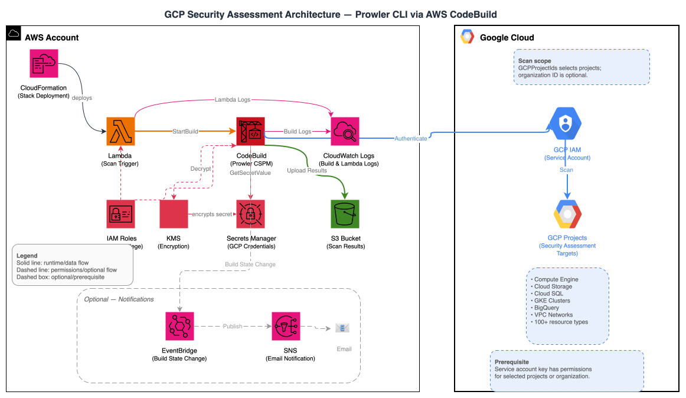

# GCP Security Assessment Templates

This directory contains CloudFormation templates for deploying GCP security assessments using Prowler. These templates provide a comprehensive, automated approach to security scanning of GCP environments from AWS infrastructure.

## Table of Contents

- [Directory Structure](#directory-structure)
- [Template Overview](#template-overview)
- [Architecture](#architecture)
- [Quick Start](#quick-start)
  - [AWS Components](#aws-components)
- [Key Features](#key-features)
- [Prerequisites](#prerequisites)
  - [GCP Environment Setup](#gcp-environment-setup)
  - [AWS Prerequisites](#aws-prerequisites)
- [Deployment](#deployment)
  - [Using `create-stack`](#using-create-stack)
- [Common Configurations](#common-configurations)
  - [Comprehensive Security Audit](#comprehensive-security-audit)
  - [Organization-Wide Scan](#organization-wide-scan)
  - [High-Performance Multi-Project](#high-performance-multi-project)
- [Configuration Parameters](#configuration-parameters)
  - [Scan Type](#scan-type)
- [Running Scans](#running-scans)
  - [Automatic Initial Scan](#automatic-initial-scan)
  - [Manual Scan Triggers](#manual-scan-triggers)
  - [View Stack Outputs](#view-stack-outputs)
  - [Monitor Scan Progress](#monitor-scan-progress)
  - [View Results](#view-results)
- [Understanding Scan Results](#understanding-scan-results)
  - [Output Formats](#output-formats)
  - [S3 Bucket Structure](#s3-bucket-structure)
  - [Analyzing Results](#analyzing-results)
- [Customization Options](#customization-options)
  - [Prowler Options](#prowler-options)
  - [Concurrent Scanning](#concurrent-scanning)
- [Security Considerations](#security-considerations)
  - [Credential Security](#credential-security)
  - [Network Security](#network-security)
  - [Access Controls](#access-controls)
- [Troubleshooting](#troubleshooting)
  - [Common Issues](#common-issues)
  - [Viewing Logs](#viewing-logs)
  - [Enhanced Error Handling](#enhanced-error-handling)
  - [Diagnostic Commands](#diagnostic-commands)
- [Cleanup / Uninstall](#cleanup--uninstall)
- [Maintenance and Updates](#maintenance-and-updates)
  - [Updates](#updates)
  - [Monitoring](#monitoring)
- [Additional Resources](#additional-resources)
- [Support](#support)

## Directory Structure

```
gcp/
├── README.md                           # This comprehensive documentation
├── codebuild-prowler-gcp.yaml          # Main GCP scanning solution
├── gcp-assessment-architecture.drawio  # Editable architecture source
└── checks/                             # Prowler check definitions
    ├── gcp_intermediate_checks.txt     # Critical and high severity checks
    ├── gcp_full_checks.txt             # Complete check list
    └── list-gcp-checks.sh              # Script to generate check lists
```

## Template Overview

| Template        | Purpose                             | Best For             |
| --------------- | ----------------------------------- | -------------------- |
| **GCP Scanner** | Security assessment of GCP projects | All GCP environments |

## Architecture



The GCP multi-project Prowler solution uses a cross-cloud architecture where AWS CodeBuild orchestrates security scans of multiple GCP projects. The diagram above illustrates the complete data flow, authentication mechanisms, and security controls involved in scanning GCP environments from AWS infrastructure.

## Quick Start

```bash
# Run from the gcp/ directory of this repository

aws cloudformation deploy \
  --template-file codebuild-prowler-gcp.yaml \
  --stack-name gcp-prowler-scanner \
  --capabilities CAPABILITY_NAMED_IAM \
  --parameter-overrides \
    GCPServiceAccountKey="$(cat prowler-key.json | jq -c .)" \
    GCPProjectIds="your-project-id" \
    EmailAddress=your-email@company.com
```

- **Multiple projects**: pass a comma-separated list, e.g. `GCPProjectIds="project1,project2,project3"`, optionally with `ConcurrentProjectScans=Three`.
- **Organization-wide**: leave `GCPProjectIds` unset and provide `GCPOrganizationId="your-organization-id"` to let Prowler discover active projects under the organization.

See [Common Configurations](#common-configurations) for more parameter combinations and the [Configuration Parameters](#configuration-parameters) table for every option.

> **Email notifications**: When `EmailAddress` is set, Amazon SNS sends a subscription confirmation email to that address. Confirm the subscription before scan-completion notifications can be delivered.

### AWS Components

The solution deploys the following AWS components:

- **AWS CodeBuild**: Runs Prowler scans against GCP projects
- **AWS Lambda**: Triggers the CodeBuild project
- **Amazon S3**: Stores scan results and reports
- **AWS Secrets Manager and AWS KMS**: Securely stores and encrypts GCP service account credentials
- **Amazon SNS**: (Optional) Sends KMS-encrypted email notifications
- **Amazon EventBridge**: Monitors scan completion
- **AWS IAM**: Manages permissions and access controls

## Key Features

- **Multi-Project Scanning**: Scan multiple GCP projects in a single execution
- **Concurrent Processing**: Configure concurrent project scans (1, 3, or 5 projects simultaneously)
- **Flexible Targeting**: Scan specific projects or organization-wide
- **Secure Credential Management**: GCP service account keys stored in AWS Secrets Manager with KMS encryption
- **Automatic Initial Scan**: Triggers a scan immediately upon deployment

## Prerequisites

### GCP Environment Setup

#### 1. Create Service Account

```bash
SCANNER_PROJECT_ID="your-scanner-project-id"
SCANNER_SA_NAME="prowler-scanner"
SCANNER_SA_EMAIL="${SCANNER_SA_NAME}@${SCANNER_PROJECT_ID}.iam.gserviceaccount.com"

# Create the service account in the scanner project
gcloud iam service-accounts create "$SCANNER_SA_NAME" \
  --project="$SCANNER_PROJECT_ID" \
  --description="Service account for Prowler security scanning" \
  --display-name="Prowler Scanner"
```

#### 2. Grant Required Permissions

For each project you want to scan:

```bash
PROJECT_ID="your-project-id"
SCANNER_SA_EMAIL="prowler-scanner@your-scanner-project-id.iam.gserviceaccount.com"

# Security Reviewer role
gcloud projects add-iam-policy-binding $PROJECT_ID \
  --member="serviceAccount:$SCANNER_SA_EMAIL" \
  --role="roles/iam.securityReviewer"

# Viewer role
gcloud projects add-iam-policy-binding $PROJECT_ID \
  --member="serviceAccount:$SCANNER_SA_EMAIL" \
  --role="roles/viewer"

# Cloud Asset Viewer role
gcloud projects add-iam-policy-binding $PROJECT_ID \
  --member="serviceAccount:$SCANNER_SA_EMAIL" \
  --role="roles/cloudasset.viewer"

# Security Center Admin Viewer role (if Security Command Center is enabled)
gcloud projects add-iam-policy-binding $PROJECT_ID \
  --member="serviceAccount:$SCANNER_SA_EMAIL" \
  --role="roles/securitycenter.adminViewer"
```

#### 3. Organization-Level Permissions (Optional)

For organization-wide scanning:

```bash
ORGANIZATION_ID="your-organization-id"
SCANNER_SA_EMAIL="prowler-scanner@your-scanner-project-id.iam.gserviceaccount.com"

gcloud organizations add-iam-policy-binding $ORGANIZATION_ID \
  --member="serviceAccount:$SCANNER_SA_EMAIL" \
  --role="roles/cloudasset.viewer"

gcloud organizations add-iam-policy-binding $ORGANIZATION_ID \
  --member="serviceAccount:$SCANNER_SA_EMAIL" \
  --role="roles/resourcemanager.organizationViewer"

gcloud organizations add-iam-policy-binding $ORGANIZATION_ID \
  --member="serviceAccount:$SCANNER_SA_EMAIL" \
  --role="roles/resourcemanager.folderViewer"
```

#### 4. Enable Required APIs

For each project:

```bash
PROJECT_ID="your-project-id"

gcloud config set project "$PROJECT_ID"
gcloud services enable cloudresourcemanager.googleapis.com
gcloud services enable iam.googleapis.com
gcloud services enable compute.googleapis.com
gcloud services enable storage.googleapis.com
gcloud services enable cloudasset.googleapis.com
gcloud services enable securitycenter.googleapis.com
```

For organization-wide scanning, also enable the Cloud Asset API in the project that owns the scanner service account:

```bash
SCANNER_PROJECT_ID="your-scanner-project-id"
gcloud services enable cloudasset.googleapis.com --project "$SCANNER_PROJECT_ID"
```

#### 5. Create Service Account Key

```bash
SCANNER_PROJECT_ID="your-scanner-project-id"
SCANNER_SA_EMAIL="prowler-scanner@${SCANNER_PROJECT_ID}.iam.gserviceaccount.com"

gcloud iam service-accounts keys create prowler-key.json \
  --iam-account="$SCANNER_SA_EMAIL" \
  --project="$SCANNER_PROJECT_ID"
```

### AWS Prerequisites

1. **AWS Account** with CloudFormation permissions
2. **AWS CLI** configured with appropriate credentials
3. **IAM permissions** to create:
   - CodeBuild projects and roles
   - S3 buckets and bucket policies
   - Secrets Manager secrets
   - KMS keys and aliases
   - Lambda functions and CloudWatch log groups
   - EventBridge rules
   - SNS topics and subscriptions (optional)

## Deployment

The [Quick Start](#quick-start) `aws cloudformation deploy` command works from AWS CloudShell or any shell with the AWS CLI configured — clone the repository, `cd gcp`, and run it.

**Note**: The template automatically triggers an initial scan upon deployment using a CloudFormation custom resource. The custom resource returns once the scan build is started; monitor the CodeBuild project logs to see when the scan itself completes.

### Using `create-stack`

As an alternative to `deploy`, use `create-stack` with `--parameters` syntax:

```bash
# Run from the gcp/ directory of this repository

aws cloudformation create-stack \
  --stack-name gcp-prowler-scanner \
  --template-body file://codebuild-prowler-gcp.yaml \
  --capabilities CAPABILITY_NAMED_IAM \
  --parameters \
    ParameterKey=GCPServiceAccountKey,ParameterValue="$(cat prowler-key.json | jq -c .)" \
    ParameterKey=GCPProjectIds,ParameterValue="project1,project2,project3" \
    ParameterKey=ConcurrentProjectScans,ParameterValue="Three" \
    ParameterKey=EmailAddress,ParameterValue="security-team@company.com"
```

## Common Configurations

A basic single-project scan is shown in [Quick Start](#quick-start). The examples below cover less common parameter combinations.

### Comprehensive Security Audit

```bash
aws cloudformation deploy \
  --template-file codebuild-prowler-gcp.yaml \
  --stack-name gcp-prowler-scanner \
  --capabilities CAPABILITY_NAMED_IAM \
  --parameter-overrides \
    GCPServiceAccountKey="$(cat prowler-key.json | jq -c .)" \
    GCPProjectIds="your-project-id" \
    ProwlerOptions="--compliance cis_2.0_gcp --ignore-exit-code-3 --output-formats csv json-ocsf html" \
    CodeBuildTimeout=120 \
    EmailAddress=security-team@company.com
```

### Organization-Wide Scan

```bash
aws cloudformation deploy \
  --template-file codebuild-prowler-gcp.yaml \
  --stack-name gcp-prowler-scanner \
  --capabilities CAPABILITY_NAMED_IAM \
  --parameter-overrides \
    GCPServiceAccountKey="$(cat prowler-key.json | jq -c .)" \
    GCPOrganizationId="your-organization-id" \
    ProwlerOptions="--ignore-exit-code-3 --output-formats csv json-ocsf html" \
    ProwlerScanType=Intermediate \
    EmailAddress=security-team@company.com
```

### High-Performance Multi-Project

```bash
aws cloudformation deploy \
  --template-file codebuild-prowler-gcp.yaml \
  --stack-name gcp-prowler-scanner \
  --capabilities CAPABILITY_NAMED_IAM \
  --parameter-overrides \
    GCPServiceAccountKey="$(cat prowler-key.json | jq -c .)" \
    GCPProjectIds="project1,project2,project3,project4,project5" \
    ConcurrentProjectScans=Five \
    ProwlerOptions="--ignore-exit-code-3 --output-formats csv json-ocsf html" \
    ProwlerScanType=Intermediate \
    EmailAddress=security-team@company.com
```

## Configuration Parameters

| Parameter                | Description                                         | Required | Default                |
| ------------------------ | --------------------------------------------------- | -------- | ---------------------- |
| `GCPServiceAccountKey`   | GCP Service Account Key in JSON format              | Yes      | -                      |
| `GCPProjectIds`          | Comma-separated list of GCP Project IDs. Leave empty for organization discovery. | Conditional | Empty                  |
| `GCPOrganizationId`      | GCP Organization ID for org-wide project discovery  | Conditional | Empty                  |
| `ProwlerScanType`        | Scan severity tier: Intermediate (critical + high checks) or Full (all checks) | No       | Intermediate           |
| `ConcurrentProjectScans` | Number of concurrent project scans (One/Three/Five) | No       | Three                  |
| `CodeBuildTimeout`       | Timeout for CodeBuild job in minutes                | No       | 480                    |
| `ProwlerOptions`         | Prowler output/reporting options; the provider and scan severity are added automatically | No       | `--ignore-exit-code-3 --output-formats csv json-ocsf html` |
| `ProwlerVersion`         | Prowler PyPI version (`latest` allowed for exploratory testing) | No       | Tested release pinned in template |
| `EmailAddress`           | Email for scan completion notifications             | No       | -                      |

Specify `GCPProjectIds`, `GCPOrganizationId`, or both. If `GCPProjectIds` is empty and `GCPOrganizationId` is set, the template runs one organization-wide Prowler scan and lets Prowler enumerate projects with Cloud Asset Inventory. If `GCPProjectIds` is set, the template keeps the concurrent per-project scan behavior.

### Scan Type

The `ProwlerScanType` parameter controls the severity tier of the scan:

- **`Intermediate`** (default): Runs all critical and high severity checks (equivalent to `--severity critical high`).
- **`Full`**: Runs every available check.

For reference, the checks included in each tier are listed in the `checks/` directory (`gcp_intermediate_checks.txt` and `gcp_full_checks.txt`), generated by `list-gcp-checks.sh`. These files are documentation snapshots only; the template does not consume them. The actual scan scope is set by `ProwlerScanType` (`Intermediate` = `--severity critical high`, `Full` = all checks).

**Note:** The default is now `Intermediate`. Earlier versions of this template ran a full scan. If you update an existing stack without setting `ProwlerScanType`, scans will narrow to critical/high severity findings. Set `ProwlerScanType=Full` to preserve the previous behavior.

## Running Scans

### Automatic Initial Scan

The template automatically starts an initial scan when deployed using a CloudFormation custom resource (`TriggerInitialScan`).

The initial scan uses the same configuration as manual scans, including the selected scan scope and custom Prowler options. You can monitor the initial scan progress in the CloudFormation console under the stack events or by checking the CodeBuild project logs.

**Note**: The custom resource completes as soon as CodeBuild accepts the start request; it does not wait for the scan to finish. A stack status of `CREATE_COMPLETE` therefore means the scan was launched successfully, not that it completed successfully. Scan duration depends on the selected checks and the size of the target environment. Track completion in CodeBuild and check S3 for results after the build succeeds.

### Manual Scan Triggers

#### Option 1: Lambda Function

```bash
# Get the Lambda function name from stack outputs
LAMBDA_FUNCTION=$(aws cloudformation describe-stacks \
  --stack-name gcp-prowler-scanner \
  --query 'Stacks[0].Outputs[?OutputKey==`LambdaFunctionName`].OutputValue' \
  --output text)

# Trigger a scan
aws lambda invoke \
  --function-name "$LAMBDA_FUNCTION" \
  response.json

cat response.json
```

#### Option 2: CodeBuild Direct

```bash
# Get the CodeBuild project name from stack outputs
CODEBUILD_PROJECT=$(aws cloudformation describe-stacks \
  --stack-name gcp-prowler-scanner \
  --query 'Stacks[0].Outputs[?OutputKey==`CodeBuildProjectName`].OutputValue' \
  --output text)

# Start the CodeBuild project directly
aws codebuild start-build --project-name "$CODEBUILD_PROJECT"
```

#### Option 3: Scheduled Scans

Create an EventBridge rule that invokes the scanner Lambda function. This example runs daily at 2:00 AM UTC:

```bash
LAMBDA_FUNCTION=$(aws cloudformation describe-stacks \
  --stack-name gcp-prowler-scanner \
  --query 'Stacks[0].Outputs[?OutputKey==`LambdaFunctionName`].OutputValue' \
  --output text)
LAMBDA_ARN=$(aws lambda get-function \
  --function-name "$LAMBDA_FUNCTION" \
  --query 'Configuration.FunctionArn' \
  --output text)
RULE_ARN=$(aws events put-rule \
  --name gcp-prowler-daily-scan \
  --schedule-expression "cron(0 2 * * ? *)" \
  --description "Daily GCP Prowler security scan" \
  --query RuleArn \
  --output text)

aws events put-targets \
  --rule gcp-prowler-daily-scan \
  --targets "Id=1,Arn=$LAMBDA_ARN"

aws lambda add-permission \
  --function-name "$LAMBDA_FUNCTION" \
  --statement-id AllowEventBridgeGCPProwlerDailyScan \
  --action lambda:InvokeFunction \
  --principal events.amazonaws.com \
  --source-arn "$RULE_ARN"
```

### View Stack Outputs

The CloudFormation stack provides several useful outputs:

```bash
# View all stack outputs
aws cloudformation describe-stacks \
  --stack-name gcp-prowler-scanner \
  --query 'Stacks[0].Outputs[*].[OutputKey,OutputValue]' \
  --output table
```

**Key Stack Outputs**:

- **S3BucketName**: S3 bucket containing scan results (format: `gcp-prowler-findings-{account-id}-{region}`)
- **CodeBuildProjectName**: CodeBuild project for triggering scans
- **LambdaFunctionName**: Lambda function to trigger scans
- **SecretsManagerArn**: ARN of the Secrets Manager secret containing the GCP service account key
- **ScanConfiguration**: Summary of your GCP scan configuration
- **UsageInstructions**: Quick reference commands for common operations
- **SecurityConsiderations**: Important security best practices
- **PrerequisiteSteps**: Steps to prepare GCP environment for scanning

### Monitor Scan Progress

```bash
# Get the CodeBuild project name
CODEBUILD_PROJECT=$(aws cloudformation describe-stacks \
  --stack-name gcp-prowler-scanner \
  --query 'Stacks[0].Outputs[?OutputKey==`CodeBuildProjectName`].OutputValue' \
  --output text)

# List recent builds
aws codebuild list-builds-for-project \
  --project-name $CODEBUILD_PROJECT \
  --sort-order DESCENDING

# Get build details
aws codebuild batch-get-builds --ids <build-id>
```

### View Results

```bash
# Get the S3 bucket name
S3_BUCKET=$(aws cloudformation describe-stacks \
  --stack-name gcp-prowler-scanner \
  --query 'Stacks[0].Outputs[?OutputKey==`S3BucketName`].OutputValue' \
  --output text)

# List scan results
aws s3 ls s3://$S3_BUCKET/ --recursive

# Download results
aws s3 sync s3://$S3_BUCKET/ ./gcp-scan-results/
```

## Understanding Scan Results

### Output Formats

Each scan generates reports in Prowler's default formats:

- **HTML**: Interactive web reports with filtering capabilities
- **CSV**: Semicolon-delimited structured data for analysis with CSV-aware tools
- **JSON-OCSF**: Open Cybersecurity Schema Framework format for security tool integration

### S3 Bucket Structure

Results are organized in S3 as follows:

```
s3://gcp-prowler-findings-{account-id}-{region}/
└── output/
    ├── compliance/
    │   └── (compliance framework reports)
    ├── prowler-output-{service-account-email}-{timestamp}.csv
    ├── prowler-output-{service-account-email}-{timestamp}.html
    ├── prowler-output-{service-account-email}-{timestamp}.ocsf.json
    └── scan-summary.txt
```

**Note**: All Prowler output files are stored directly in the `output/` folder. The `compliance/` subfolder contains compliance framework-specific reports when compliance checks are enabled. File names include the GCP service account email used for scanning.

### Analyzing Results

Use the downloaded JSON-OCSF reports for repeatable analysis:

```bash
# Count findings by severity
jq -r '.[] | .severity' gcp-scan-results/output/*.ocsf.json |
  sort | uniq -c | sort -nr

# Extract critical findings
jq '.[] |
  select((.severity // "" | ascii_downcase) == "critical") |
  {title: .finding_info.title, resource: .resources[0].name, status: .status_code}' \
  gcp-scan-results/output/*.ocsf.json

# Count failed findings by service
jq -r '.[] |
  select(.status_code == "FAIL") |
  .resources[]?.group.name' gcp-scan-results/output/*.ocsf.json |
  sort | uniq -c | sort -nr
```

## Customization Options

### Prowler Options

You can add custom Prowler output/reporting and additional filtering options via the `ProwlerOptions` parameter. Scan severity is controlled separately by the `ProwlerScanType` parameter (`Intermediate` = `--severity critical high`, `Full` = all checks), so you do not need to pass `--severity` here:

**Compliance Frameworks**:

Available compliance identifiers depend on the installed Prowler version. Use the same release configured by `ProwlerVersion` to list the supported frameworks:

```bash
prowler gcp --no-banner --list-compliance
```

Validated example:

```bash
--parameter-overrides ProwlerOptions="--compliance cis_2.0_gcp --ignore-exit-code-3 --output-formats csv json-ocsf html"
```

```bash
# Example: Scan only specific services
--parameter-overrides ProwlerOptions="--services compute iam storage --ignore-exit-code-3 --output-formats csv json-ocsf html"

# Example: Exclude specific checks
--parameter-overrides ProwlerOptions="--excluded-checks compute_instance_public_ip --ignore-exit-code-3 --output-formats csv json-ocsf html"

# Note: Severity is now set via ProwlerScanType=Intermediate (critical + high) or
# ProwlerScanType=Full (all checks) instead of passing --severity manually in ProwlerOptions.
```

**Default Options**: The template includes `--ignore-exit-code-3 --output-formats csv json-ocsf html` by default, which prevents failed findings from failing the build and creates CSV, JSON-OCSF, and HTML reports. When adding custom options, include these flags to maintain consistent behavior.

### Concurrent Scanning

Adjust the number of projects scanned simultaneously:

```bash
--parameter-overrides ConcurrentProjectScans="Five"  # Options: One, Three, Five
```

## Security Considerations

### Credential Security

- GCP service account keys are encrypted at rest in AWS Secrets Manager
- CodeBuild uses IAM roles with least-privilege access
- S3 bucket enforces encryption in transit and explicit SSE-S3 encryption at rest
- Optional SNS notification topics are encrypted with stack-managed AWS KMS keys
- Lambda and CodeBuild execution logs are written to CloudWatch Logs; AWS control-plane activity is available through CloudTrail

### Network Security

- CodeBuild runs in an AWS-managed build environment and is not attached to a VPC by this template
- Outbound internet access is required to download dependencies and call GCP APIs
- No inbound network access required
- All communication uses HTTPS/TLS

### Access Controls

- IAM roles follow principle of least privilege
- S3 bucket blocks public access
- CloudWatch logs provide audit trail

## Troubleshooting

### Common Issues

#### Authentication Failures

```bash
# Check if service account key is valid
gcloud auth activate-service-account --key-file=prowler-key.json
gcloud projects list
```

#### Permission Errors

```bash
# Verify service account has required roles
gcloud projects get-iam-policy PROJECT_ID \
  --flatten="bindings[].members" \
  --format="table(bindings.role)" \
  --filter="bindings.members:prowler-scanner@your-scanner-project-id.iam.gserviceaccount.com"
```

#### API Not Enabled

```bash
# Check enabled APIs
gcloud services list --enabled --project=PROJECT_ID

# Enable required APIs
gcloud services enable cloudresourcemanager.googleapis.com --project=PROJECT_ID
```

#### Google Cloud SDK Installation Issues

The template automatically downloads and installs the Google Cloud SDK during the build process. If installation fails:

1. **Check CodeBuild logs** for specific error messages during the install phase
2. **Verify internet connectivity** - CodeBuild needs access to download the SDK
3. **Check disk space** - The SDK requires several hundred MB of space

The template includes automatic cleanup of SDK files before uploading results to S3 to minimize storage costs.

### Viewing Logs

```bash
# Get CodeBuild logs
aws logs describe-log-groups --log-group-name-prefix "/aws/codebuild/GCPProwler"

# Get specific log stream
aws logs get-log-events \
  --log-group-name "/aws/codebuild/GCPProwler-{stack-name}" \
  --log-stream-name "{build-id}"
```

### Enhanced Error Handling

The template includes comprehensive error handling and validation:

1. **Tool Verification**: Checks all required tools (Python, pip, Prowler, gcloud, jq) before proceeding
2. **Credential Validation**: Validates GCP service account key and project access before scanning
3. **Authentication Retry**: Implements retry logic for GCP authentication with up to 3 attempts
4. **Project Verification**: Verifies access to each project before starting scans
5. **Detailed Logging**: Provides clear success/failure indicators for easy identification

### Diagnostic Commands

#### Check Stack Status

```bash
# Get stack status and outputs
aws cloudformation describe-stacks --stack-name gcp-prowler-scanner

# Check stack events for errors
aws cloudformation describe-stack-events --stack-name gcp-prowler-scanner
```

#### Monitor CodeBuild

```bash
# List recent builds
aws codebuild list-builds-for-project --project-name GCPProwler-gcp-prowler-scanner

# Stream build logs
aws logs tail /aws/codebuild/GCPProwler-gcp-prowler-scanner --follow
```

#### Verify Permissions

```bash
# Check Secrets Manager access
aws secretsmanager describe-secret --secret-id gcp-prowler-scanner-gcp-credentials

# Verify S3 bucket exists
aws s3 ls | grep gcp-prowler-findings

# Test GCP service account authentication
gcloud auth activate-service-account --key-file=prowler-key.json
gcloud projects list
```

## Cleanup / Uninstall

Download any reports that must be retained, then follow the root [Cleanup / Uninstall](../README.md#cleanup--uninstall) procedure. Deleting the scanner stack does not delete the versioned findings bucket; the bucket must be emptied of all object versions and delete markers before it can be removed.

After deleting the AWS resources, revoke the GCP service account key created for the scanner and delete any local copies of `prowler-key.json`. If the service account was created only for this assessment, remove its project or organization IAM bindings and delete the service account.

## Maintenance and Updates

### Updates

- Prowler version is controlled by the `ProwlerVersion` parameter (defaults to the tested release pinned in the template; use `latest` only for exploratory testing)
- Template uses Python 3.12 runtime with enhanced error handling
- CloudFormation template should be updated periodically
- Monitor AWS service updates that might affect the solution

### Monitoring

- Set up CloudWatch alarms for failed builds
- Monitor S3 storage costs and usage
- Track scan execution times and optimize as needed

## Additional Resources

- [Prowler Documentation](https://docs.prowler.com/)
- [GCP Security Best Practices](https://cloud.google.com/security/best-practices)
- [CloudFormation User Guide](https://docs.aws.amazon.com/cloudformation/)
- [GCP IAM Documentation](https://docs.cloud.google.com/iam/docs)

## Support

Check the [Troubleshooting](#troubleshooting) section and the CloudWatch logs for error messages first. For unresolved problems, open an issue in the repository.
