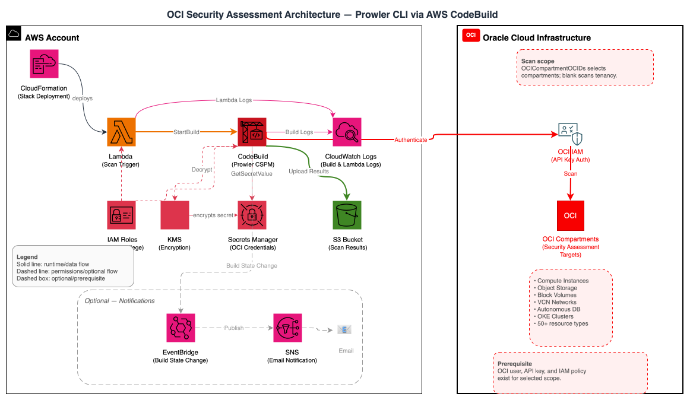

# OCI Security Assessment Templates

This directory contains CloudFormation templates for deploying OCI security assessments using Prowler. These templates provide a comprehensive, automated approach to security scanning of Oracle Cloud Infrastructure environments from AWS infrastructure.

## Table of Contents

- [Directory Structure](#directory-structure)
- [Template Overview](#template-overview)
- [Architecture](#architecture)
- [Quick Start](#quick-start)
  - [AWS Components](#aws-components)
- [Overview](#overview)
- [Key Features](#key-features)
- [Prerequisites](#prerequisites)
  - [OCI Environment Setup](#oci-environment-setup)
  - [AWS Prerequisites](#aws-prerequisites)
- [Deployment](#deployment)
- [Common Configurations](#common-configurations)
  - [Comprehensive Security Audit](#comprehensive-security-audit)
  - [High-Performance Multi-Compartment](#high-performance-multi-compartment)
  - [Verify Deployment](#verify-deployment)
- [Configuration Parameters](#configuration-parameters)
  - [Scan Type](#scan-type)
- [Running Scans](#running-scans)
  - [Automatic Initial Scan](#automatic-initial-scan)
  - [Manual Scan Triggers](#manual-scan-triggers)
  - [Monitor Scan Progress](#monitor-scan-progress)
- [Understanding Scan Results](#understanding-scan-results)
  - [Output Formats](#output-formats)
  - [S3 Bucket Structure](#s3-bucket-structure)
  - [Accessing Results](#accessing-results)
  - [Analyzing Results](#analyzing-results)
- [Customization Options](#customization-options)
  - [Prowler Options](#prowler-options)
  - [Compartment Scanning](#compartment-scanning)
  - [Concurrent Scanning](#concurrent-scanning)
  - [Timeout Configuration](#timeout-configuration)
- [Security Considerations](#security-considerations)
  - [Credential Security](#credential-security)
  - [Network Security](#network-security)
  - [Access Controls](#access-controls)
- [Troubleshooting](#troubleshooting)
  - [Common Issues](#common-issues)
  - [Viewing Logs](#viewing-logs)
  - [Built-in Error Handling](#built-in-error-handling)
  - [Diagnostic Commands](#diagnostic-commands)
- [Cleanup / Uninstall](#cleanup--uninstall)
- [Maintenance and Updates](#maintenance-and-updates)
  - [Updates](#updates)
  - [Monitoring](#monitoring)
- [Additional Resources](#additional-resources)
- [Support](#support)

## Directory Structure

```
oci/
├── README.md                           # This comprehensive documentation
├── codebuild-prowler-oci.yaml          # Main OCI scanning solution
├── oci-assessment-architecture.drawio  # Editable architecture source
└── checks/                             # Prowler check definitions
    ├── oci_intermediate_checks.txt     # Critical and high severity checks
    ├── oci_full_checks.txt             # Complete check list
    └── list-oci-checks.sh              # Script to generate check lists
```

## Template Overview

| Template        | Purpose                              | Best For             |
| --------------- | ------------------------------------ | -------------------- |
| **OCI Scanner** | Security assessment of OCI tenancies | All OCI environments |

## Architecture



The OCI Prowler solution uses a cross-cloud architecture where AWS CodeBuild orchestrates security scans of OCI tenancies. The diagram above illustrates the complete data flow, authentication mechanisms, and security controls involved in scanning OCI environments from AWS infrastructure.

## Quick Start

```bash
# Run from the oci/ directory of this repository

aws cloudformation deploy \
  --template-file codebuild-prowler-oci.yaml \
  --stack-name oci-prowler-scanner \
  --capabilities CAPABILITY_NAMED_IAM \
  --parameter-overrides \
    OCIUserOCID=ocid1.user.oc1..aaaaaaaexample \
    OCITenancyOCID=ocid1.tenancy.oc1..aaaaaaaexample \
    OCIFingerprint=aa:bb:cc:dd:ee:ff:00:11:22:33:44:55:66:77:88:99 \
    OCIPrivateKey="$(jq -Rs . < ~/.oci/oci_api_key.pem)" \
    OCIRegion=us-ashburn-1 \
    EmailAddress=your-email@company.com
```

By default this scans the entire tenancy. To limit the scan to specific compartments, add `OCICompartmentOCIDs=ocid1.compartment.oc1..example1,ocid1.compartment.oc1..example2`, optionally with `ConcurrentCompartmentScans=Three`.

See [Common Configurations](#common-configurations) for more parameter combinations and the [Configuration Parameters](#configuration-parameters) table for every option.

> **Email notifications**: When `EmailAddress` is set, Amazon SNS sends a subscription confirmation email to that address. Confirm the subscription before scan-completion notifications can be delivered.

### AWS Components

The solution deploys the following AWS components:

- **AWS CodeBuild**: Runs Prowler scans against OCI tenancies
- **AWS Lambda**: Triggers the CodeBuild project
- **Amazon S3**: Stores scan results and reports
- **AWS Secrets Manager and AWS KMS**: Securely stores and encrypts OCI API credentials
- **Amazon SNS**: (Optional) Sends KMS-encrypted email notifications
- **Amazon EventBridge**: Monitors scan completion
- **AWS IAM**: Manages permissions and access controls

## Overview

This CloudFormation template deploys an automated security scanning pipeline that:

- Runs Prowler's OCI security checks (CIS benchmarks, encryption, networking, IAM, etc.); the default Intermediate tier runs the critical/high subset, while a Full scan covers all 50+ checks
- Stores results in S3 (CSV, HTML, JSON-OCSF formats)
- Sends optional KMS-encrypted email notifications on scan completion
- Supports concurrent compartment scanning

## Key Features

- **Tenancy-Wide Scanning**: Scan entire OCI tenancy or specific compartments
- **Concurrent Processing**: Configure concurrent compartment scans (1, 3, or 5 compartments simultaneously)
- **Secure Credential Management**: OCI API keys stored in AWS Secrets Manager with KMS encryption
- **Automatic Initial Scan**: Triggers a scan immediately upon deployment

## Prerequisites

### OCI Environment Setup

#### 1. Create an OCI API Signing Key

```bash
# Generate a 2048-bit RSA key pair
openssl genrsa -out ~/.oci/oci_api_key.pem 2048
chmod 600 ~/.oci/oci_api_key.pem

# Generate the public key
openssl rsa -pubout -in ~/.oci/oci_api_key.pem -out ~/.oci/oci_api_key_public.pem
```

#### 2. Upload the Public Key to OCI

1. Log in to the OCI Console
2. Navigate to **Identity & Security > Users > Your User > API Keys**
3. Click **Add API Key** and upload `oci_api_key_public.pem`
4. Note the **Fingerprint** displayed after upload

#### 3. Create an OCI Group and Policies for Prowler

Create an IAM group and assign the scanning user to it:

```
Allow group ProwlerScanners to inspect all-resources in tenancy
Allow group ProwlerScanners to read all-resources in tenancy
Allow group ProwlerScanners to read audit-events in tenancy
Allow group ProwlerScanners to read cloud-guard-config in tenancy
Allow group ProwlerScanners to read cloud-guard-problems in tenancy
Allow group ProwlerScanners to read cloud-guard-targets in tenancy
```

These read-only policies allow Prowler to assess your OCI security posture without making any changes. The `audit-events` and `cloud-guard-*` permissions are required for audit log retention and Cloud Guard checks respectively.

#### 4. Gather Required Information

You will need:

| Parameter        | Where to Find                                     |
| ---------------- | ------------------------------------------------- |
| **User OCID**    | OCI Console > Identity > Users > Your User        |
| **Tenancy OCID** | OCI Console > Administration > Tenancy Details    |
| **Fingerprint**  | Displayed when you uploaded the API key           |
| **Private Key**  | Contents of `~/.oci/oci_api_key.pem`, JSON-encoded via `jq -Rs . < ~/.oci/oci_api_key.pem` (see note below) |
| **Region**       | Your OCI region identifier (e.g., `us-ashburn-1`) |

> **Note on the private key**: A PEM file spans multiple lines, and the template stores it as a JSON-encoded string in AWS Secrets Manager. Pass it as `jq -Rs . < ~/.oci/oci_api_key.pem` so newlines are escaped correctly; the CodeBuild job decodes that string before writing the OCI config file. Passing the raw `cat` of the PEM will fail private-key parsing.

### AWS Prerequisites

1. **AWS Account** with CloudFormation permissions
2. **AWS CLI** configured with appropriate credentials
3. **IAM permissions** to create:
   - CodeBuild projects and roles
   - S3 buckets and policies
   - Secrets Manager secrets
   - KMS keys and aliases
   - Lambda functions
   - SNS topics (optional)

## Deployment

The [Quick Start](#quick-start) `aws cloudformation deploy` command works from AWS CloudShell or any shell with the AWS CLI configured — clone the repository, `cd oci`, and run it.

**Using the AWS Console**: navigate to **CloudFormation > Create Stack**, upload `codebuild-prowler-oci.yaml`, fill in the OCI configuration parameters, then acknowledge IAM capabilities and create the stack.

## Common Configurations

A basic single-tenancy scan is shown in [Quick Start](#quick-start). The examples below cover less common parameter combinations.

### Comprehensive Security Audit

```bash
aws cloudformation deploy \
  --template-file codebuild-prowler-oci.yaml \
  --stack-name oci-prowler-scanner \
  --capabilities CAPABILITY_NAMED_IAM \
  --parameter-overrides \
    OCIUserOCID=ocid1.user.oc1..example \
    OCITenancyOCID=ocid1.tenancy.oc1..example \
    OCIFingerprint=your-fingerprint \
    OCIPrivateKey="$(jq -Rs . < ~/.oci/oci_api_key.pem)" \
    OCIRegion=us-ashburn-1 \
    ProwlerOptions="--compliance cis_3.1_oraclecloud --ignore-exit-code-3 --output-formats csv json-ocsf html" \
    CodeBuildTimeout=120 \
    EmailAddress=security-team@company.com
```

### High-Performance Multi-Compartment

```bash
aws cloudformation deploy \
  --template-file codebuild-prowler-oci.yaml \
  --stack-name oci-prowler-scanner \
  --capabilities CAPABILITY_NAMED_IAM \
  --parameter-overrides \
    OCIUserOCID=ocid1.user.oc1..example \
    OCITenancyOCID=ocid1.tenancy.oc1..example \
    OCIFingerprint=your-fingerprint \
    OCIPrivateKey="$(jq -Rs . < ~/.oci/oci_api_key.pem)" \
    OCIRegion=us-ashburn-1 \
    OCICompartmentOCIDs=ocid1.compartment.oc1..example1,ocid1.compartment.oc1..example2 \
    ConcurrentCompartmentScans=Five \
    ProwlerScanType=Intermediate \
    ProwlerOptions="--ignore-exit-code-3 --output-formats csv json-ocsf html" \
    EmailAddress=security-team@company.com
```

### Verify Deployment

Check that all resources were created successfully:

```bash
# Check stack status and outputs
aws cloudformation describe-stacks --stack-name oci-prowler-scanner

# View helpful outputs from the stack
aws cloudformation describe-stacks \
  --stack-name oci-prowler-scanner \
  --query 'Stacks[0].Outputs[*].[OutputKey,OutputValue]' \
  --output table
```

**Key Stack Outputs**:

- **S3BucketName**: S3 bucket containing scan results (format: `oci-prowler-findings-{account-id}-{region}`)
- **CodeBuildProjectName**: CodeBuild project for triggering scans
- **LambdaFunctionName**: Lambda function to trigger scans
- **SecretsManagerArn**: ARN of the Secrets Manager secret containing the JSON-encoded OCI private key

## Configuration Parameters

| Parameter                    | Required | Default                | Description                             |
| ---------------------------- | -------- | ---------------------- | --------------------------------------- |
| `OCIUserOCID`                | Yes      | -                      | OCI User OCID for API authentication    |
| `OCITenancyOCID`             | Yes      | -                      | OCI Tenancy OCID                        |
| `OCIFingerprint`             | Yes      | -                      | API key fingerprint                     |
| `OCIPrivateKey`              | Yes      | -                      | PEM-encoded private key, JSON-encoded (`jq -Rs . < oci_api_key.pem`) |
| `OCIRegion`                  | Yes      | -                      | OCI region identifier                   |
| `OCICompartmentOCIDs`        | No       | (entire tenancy)       | Comma-separated compartment OCIDs       |
| `ProwlerScanType`            | No       | Intermediate           | Scan severity tier: Intermediate (critical + high checks) or Full (all checks) |
| `ConcurrentCompartmentScans` | No       | Three                  | Concurrency level: One, Three, or Five  |
| `CodeBuildTimeout`           | No       | 480                    | Timeout in minutes (30-2160)            |
| `ProwlerOptions`       | No       | `--ignore-exit-code-3 --output-formats csv json-ocsf html` | Prowler output/reporting options; the provider and scan severity are added automatically |
| `ProwlerVersion`             | No       | Tested release pinned in template | Prowler PyPI version (`latest` allowed for exploratory testing) |
| `EmailAddress`               | No       | -                      | Email for scan completion notifications |

### Scan Type

The `ProwlerScanType` parameter selects how broad the scan is:

- **Intermediate** (default): runs all critical and high severity checks (`--severity critical high`).
- **Full**: runs every available check.

For reference, the checks included in each tier are listed in the `checks/` directory (`oci_intermediate_checks.txt` and `oci_full_checks.txt`), generated by `list-oci-checks.sh`. These files are documentation snapshots only; the template does not consume them. The actual scan scope is set by `ProwlerScanType` (`Intermediate` = `--severity critical high`, `Full` = all checks).

**Note:** The default is now `Intermediate`. Earlier versions of this template ran a full scan. If you update an existing stack without setting `ProwlerScanType`, scans will narrow to critical/high severity findings. Set `ProwlerScanType=Full` to preserve the previous behavior.

## Running Scans

### Automatic Initial Scan

The template automatically starts an initial scan when deployed using a CloudFormation custom resource (`TriggerInitialScan`).

The initial scan uses the same configuration as manual scans, including all specified compartments and custom Prowler options. You can monitor the initial scan progress in the CloudFormation console under the stack events or by checking the CodeBuild project logs.

**Note**: The custom resource completes as soon as CodeBuild accepts the start request; it does not wait for the scan to finish. A stack status of `CREATE_COMPLETE` therefore means the scan was launched successfully, not that it completed successfully. Scan duration depends on the selected checks and the size of the target environment. Track completion in CodeBuild and check S3 for results after the build succeeds.

### Manual Scan Triggers

#### Option 1: Lambda Function

```bash
# Get the Lambda function name from stack outputs
LAMBDA_FUNCTION=$(aws cloudformation describe-stacks \
  --stack-name oci-prowler-scanner \
  --query 'Stacks[0].Outputs[?OutputKey==`LambdaFunctionName`].OutputValue' \
  --output text)

# Trigger a scan
aws lambda invoke \
  --function-name $LAMBDA_FUNCTION \
  response.json

cat response.json
```

#### Option 2: CodeBuild Direct

```bash
# Get the CodeBuild project name
CODEBUILD_PROJECT=$(aws cloudformation describe-stacks \
  --stack-name oci-prowler-scanner \
  --query 'Stacks[0].Outputs[?OutputKey==`CodeBuildProjectName`].OutputValue' \
  --output text)

# Start CodeBuild project directly
aws codebuild start-build --project-name $CODEBUILD_PROJECT
```

#### Option 3: Scheduled Scans

Create an EventBridge rule for scheduled scans:

```bash
# Create scheduled rule (daily at 2 AM UTC)
ACCOUNT_ID=$(aws sts get-caller-identity --query Account --output text)
REGION=$(aws configure get region)
OCI_LAMBDA_FUNCTION=OCIProwlerTrigger-oci-prowler-scanner

aws events put-rule \
  --name oci-prowler-daily-scan \
  --schedule-expression "cron(0 2 * * ? *)" \
  --description "Daily OCI Prowler security scan"

# Add Lambda target
aws events put-targets \
  --rule oci-prowler-daily-scan \
  --targets "Id"="1","Arn"="arn:aws:lambda:${REGION}:${ACCOUNT_ID}:function:${OCI_LAMBDA_FUNCTION}"

# Allow EventBridge to invoke the Lambda target
aws lambda add-permission \
  --function-name "$OCI_LAMBDA_FUNCTION" \
  --statement-id AllowEventBridgeOCIProwlerDailyScan \
  --action lambda:InvokeFunction \
  --principal events.amazonaws.com \
  --source-arn "arn:aws:events:${REGION}:${ACCOUNT_ID}:rule/oci-prowler-daily-scan"
```

### Monitor Scan Progress

```bash
# List recent builds
aws codebuild list-builds-for-project \
  --project-name $CODEBUILD_PROJECT \
  --sort-order DESCENDING

# Get build details
aws codebuild batch-get-builds --ids <build-id>

# View build logs
aws logs get-log-events \
  --log-group-name "/aws/codebuild/OCIProwler-oci-prowler-scanner" \
  --log-stream-name "<log-stream-name>"
```

## Understanding Scan Results

### Output Formats

Each scan generates reports in Prowler's default formats:

- **HTML**: Interactive web reports with filtering capabilities
- **CSV**: Semicolon-delimited structured data for analysis with CSV-aware tools
- **JSON-OCSF**: Open Cybersecurity Schema Framework format for security tool integration

### S3 Bucket Structure

```
oci-prowler-findings-{account-id}-{region}/
└── output/
    ├── compliance/
    │   └── (compliance framework reports)
    ├── prowler-output-{tenancy-ocid}-{timestamp}.csv
    ├── prowler-output-{tenancy-ocid}-{timestamp}.html
    ├── prowler-output-{tenancy-ocid}-{timestamp}.ocsf.json
    └── scan-summary.txt
```

**Note**: All Prowler output files are stored directly in the `output/` folder. The `compliance/` subfolder contains compliance framework-specific reports when compliance checks are enabled.

### Accessing Results

```bash
# Get the S3 bucket name
S3_BUCKET=$(aws cloudformation describe-stacks \
  --stack-name oci-prowler-scanner \
  --query 'Stacks[0].Outputs[?OutputKey==`S3BucketName`].OutputValue' \
  --output text)

# List scan results
aws s3 ls s3://$S3_BUCKET/output/ --recursive

# Download results locally
aws s3 sync s3://$S3_BUCKET/output/ ./oci-results/

# Download specific file types
aws s3 cp s3://$S3_BUCKET/output/ ./results/ --recursive --exclude "*" --include "*.html"
```

### Analyzing Results

Use the downloaded JSON-OCSF reports for repeatable analysis:

```bash
# Count findings by severity
jq -r '.[] | .severity' oci-results/*.ocsf.json |
  sort | uniq -c | sort -nr

# Extract critical findings
jq '.[] |
  select((.severity // "" | ascii_downcase) == "critical") |
  {title: .finding_info.title, resource: .resources[0].name, status: .status_code}' \
  oci-results/*.ocsf.json

# Count failed findings by service
jq -r '.[] |
  select(.status_code == "FAIL") |
  .resources[]?.group.name' oci-results/*.ocsf.json |
  sort | uniq -c | sort -nr
```

## Customization Options

### Prowler Options

You can specify output/reporting and additional filtering options using the `ProwlerOptions` parameter. Scan **severity** is controlled separately by the `ProwlerScanType` parameter (Intermediate = `--severity critical high`, Full = all checks), so you do not need to pass `--severity` here.

**Severity Filtering**:

Severity is set via `ProwlerScanType=Intermediate` or `ProwlerScanType=Full` instead of passing `--severity` manually in `ProwlerOptions`.

**Compliance Frameworks**:

Available compliance identifiers depend on the installed Prowler version. Use the same release configured by `ProwlerVersion` to list the supported frameworks:

```bash
prowler oraclecloud --no-banner --list-compliance
```

Validated example:

```bash
--parameter-overrides ProwlerOptions="--compliance cis_3.1_oraclecloud --ignore-exit-code-3 --output-formats csv json-ocsf html"
```

**Specific Checks**:

```bash
--parameter-overrides ProwlerOptions="--check identity_password_policy_minimum_length_14 --ignore-exit-code-3 --output-formats csv json-ocsf html"
```

**Specific Services**:

```bash
--parameter-overrides ProwlerOptions="--service identity network objectstorage --ignore-exit-code-3 --output-formats csv json-ocsf html"
```

**Default Options**: The template includes `--ignore-exit-code-3 --output-formats csv json-ocsf html` by default, which prevents failed findings from failing the build and creates CSV, JSON-OCSF, and HTML reports.

### Compartment Scanning

Limit scans to specific compartments:

```bash
--parameter-overrides OCICompartmentOCIDs="ocid1.compartment.oc1..example1,ocid1.compartment.oc1..example2"
```

### Concurrent Scanning

Control the number of compartments scanned simultaneously:

- **One**: Single compartment at a time (BUILD_GENERAL1_SMALL)
- **Three**: Three compartments concurrently (BUILD_GENERAL1_MEDIUM) - Default
- **Five**: Five compartments concurrently (BUILD_GENERAL1_LARGE)

```bash
--parameter-overrides ConcurrentCompartmentScans="Five"
```

### Timeout Configuration

Adjust `CodeBuildTimeout` based on environment size:

- **Small environments**: 60-120 minutes
- **Medium environments**: 120-240 minutes
- **Large environments**: 240-480 minutes

## Security Considerations

### Credential Security

- OCI API credentials are stored in AWS Secrets Manager with KMS encryption at rest
- CodeBuild uses IAM roles with least-privilege access
- S3 bucket enforces encryption in transit and explicit SSE-S3 encryption at rest
- Optional SNS notification topics are encrypted with stack-managed AWS KMS keys
- Lambda and CodeBuild execution logs are written to CloudWatch Logs; AWS control-plane activity is available through CloudTrail

### Network Security

- CodeBuild runs in an AWS-managed build environment and is not attached to a VPC by this template
- Outbound internet access is required to download dependencies and call OCI APIs
- No inbound network access required
- All communication uses HTTPS/TLS

### Access Controls

- IAM roles follow principle of least privilege
- S3 bucket blocks public access
- CloudWatch logs provide audit trail
- Lambda and CodeBuild roles use `aws:SourceAccount` conditions, and the CodeBuild role also scopes trust to the created project ARN

## Troubleshooting

### Common Issues

#### Authentication Failures

**Error**: `AuthenticationError: Could not authenticate`

```bash
# Verify your API key configuration
cat ~/.oci/config

# Test OCI CLI authentication
oci iam user get --user-id <your-user-ocid>

# Check fingerprint matches
openssl rsa -pubout -outform DER -in ~/.oci/oci_api_key.pem | openssl md5 -c
```

#### Permission Errors

**Error**: `Authorization failed or requested resource not found`

```bash
# Verify policies are in place
oci iam policy list --compartment-id <tenancy-ocid> --all

# Check group membership
oci iam group list-members --group-id <group-ocid>
```

#### Secrets Manager Issues

**Error**: `Failed to retrieve OCI private key from Secrets Manager`

```bash
# Verify secret exists
aws secretsmanager describe-secret \
  --secret-id oci-prowler-scanner-oci-credentials

# Check secret value (careful with sensitive data; this is a JSON-encoded string)
aws secretsmanager get-secret-value \
  --secret-id oci-prowler-scanner-oci-credentials \
  --query 'SecretString' --output text | jq -r .
```

#### CodeBuild Timeout Issues

**Error**: `Build timed out`

- Increase `CodeBuildTimeout` parameter
- Reduce `ConcurrentCompartmentScans` for large tenancies
- Filter scans by specific compartments

### Viewing Logs

```bash
# Get CodeBuild logs
aws logs describe-log-groups --log-group-name-prefix "/aws/codebuild/OCIProwler"

# Get specific log stream
aws logs get-log-events \
  --log-group-name "/aws/codebuild/OCIProwler-oci-prowler-scanner" \
  --log-stream-name "<build-id>"
```

### Built-in Error Handling

The template includes comprehensive error handling and validation:

1. **Tool Installation**: Installs required tools and prints the Prowler version before scanning
2. **Credential Validation**: Validates OCI credentials before attempting authentication
3. **Connectivity Check**: Verifies OCI tenancy connectivity using the OCI Python SDK
4. **Compartment Failure Tracking**: Tracks and reports failed compartment scans
5. **Parameter Validation**: CloudFormation-level validation for OCID formats and required fields
6. **Detailed Logging**: Provides clear success/failure indicators for easy identification

### Diagnostic Commands

#### Check Stack Status

```bash
# Get stack status and outputs
aws cloudformation describe-stacks --stack-name oci-prowler-scanner

# Check stack events for errors
aws cloudformation describe-stack-events --stack-name oci-prowler-scanner
```

#### Monitor CodeBuild

```bash
# List recent builds
aws codebuild list-builds-for-project --project-name OCIProwler-oci-prowler-scanner

# Stream build logs
aws logs tail /aws/codebuild/OCIProwler-oci-prowler-scanner --follow
```

#### Verify Permissions

```bash
# Check Secrets Manager access
aws secretsmanager describe-secret --secret-id oci-prowler-scanner-oci-credentials

# Verify S3 bucket exists
aws s3 ls | grep oci-prowler-findings

# Test OCI authentication
oci iam user get --user-id <your-user-ocid>
```

## Cleanup / Uninstall

Download any reports that must be retained, then follow the root [Cleanup / Uninstall](../README.md#cleanup--uninstall) procedure. Deleting the scanner stack does not delete the versioned findings bucket; the bucket must be emptied of all object versions and delete markers before it can be removed.

After deleting the AWS resources, remove the uploaded API key from the OCI user by matching its fingerprint, then delete local copies of the private key. If the user, group, or IAM policies were created only for this assessment, remove those resources after confirming they are not used elsewhere.

## Maintenance and Updates

### Updates

- Prowler version is controlled by the `ProwlerVersion` parameter (defaults to the tested release pinned in the template; use `latest` only for exploratory testing)
- Template uses Python 3.12 runtime with enhanced error handling
- CloudFormation template should be updated periodically
- Monitor AWS and OCI service updates that might affect the solution

### Monitoring

- Set up CloudWatch alarms for failed builds
- Monitor S3 storage costs and usage
- Track scan execution times and optimize as needed

## Additional Resources

- [Prowler Documentation](https://docs.prowler.com/)
- [OCI Security Documentation](https://docs.oracle.com/en-us/iaas/Content/Security/Concepts/security_guide.htm)
- [CIS OCI Foundations Benchmark](https://www.cisecurity.org/benchmark/oracle_cloud)
- [CloudFormation User Guide](https://docs.aws.amazon.com/cloudformation/)

## Support

Check the [Troubleshooting](#troubleshooting) section and the CloudWatch logs for error messages first. For unresolved problems, open an issue in the repository.
